Motivation. The other day I was analizing a web page with devtools, then found some errors, and I thought it was a good oportunity to explain how this errors can lead to a bigger thing.

I will not disclose the domain path:

The first line shows where exactly the variable is not defined.

Uncaught TypeError: Cannot read properties of undefined (reading 'new_zero_result_page') at Object.attach (<THE_FILE>). Checking that line on the file:

The new_zero_result_page error is because newZeroResultPage is not defined. The only reference to that variable is on the var definition:

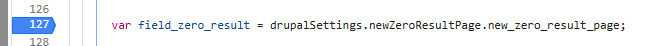

For solving the problem we can :define the newZeroResultPage. For that is posible to add a breakpoint before the function that breaks the code and gives the error. Adding the breakpoint:

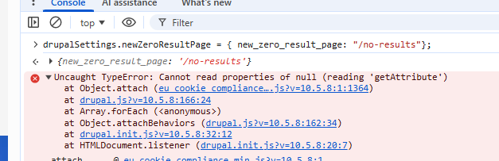

Reloading the page, the execution will stop just before the line 127, after we can write on the console the definition drupalSettings.newZeroResultPage = { new_zero_result_page: "/no-results" }; that will solve the problem:

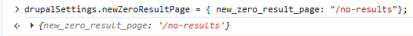

After this definition , right click on the line 127 and click on continue the run here. Later on the problem will be solved, and only its going to be one error:

If this undefined variable was used on a DOM related part of the JS front code will allow to a DOM XSS. For that we can check where this variable is used:

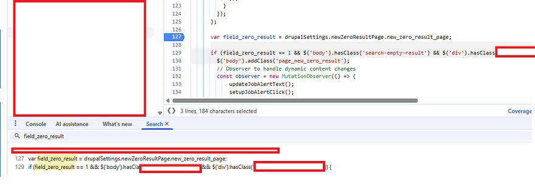

The variable is just used for a comparation, later on there are not other definitions refering to that object so, is just minor bug.
Handcrafting the same situation at a home lab.
The next part will show that on a small example , where the JS code reference that variable and allows to a DOM XSS.
I created a small page with the following text:

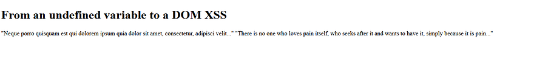

And this is the script I defined:

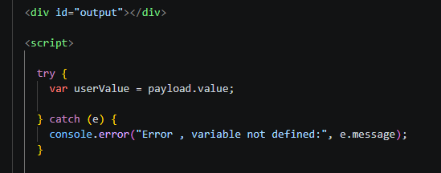

If the page is inspected with devtools , the following error is given:

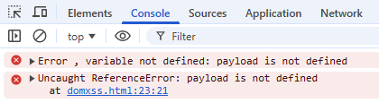

Payload is not defined wich is true.
So , lets define payload , on the console and locally (for when we reload) the variable is going to be still there:
local:

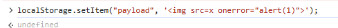

On the console:

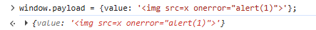

And finally using the vulnerable asignation of innerHTML to the asignation of user.value:

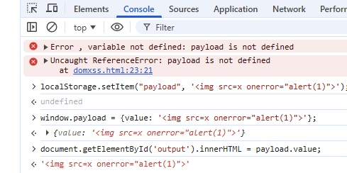

Finally, if we execute the document.getElementById('output').innerHTML = payload.value , its gonna execute the payload:

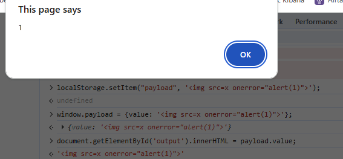
